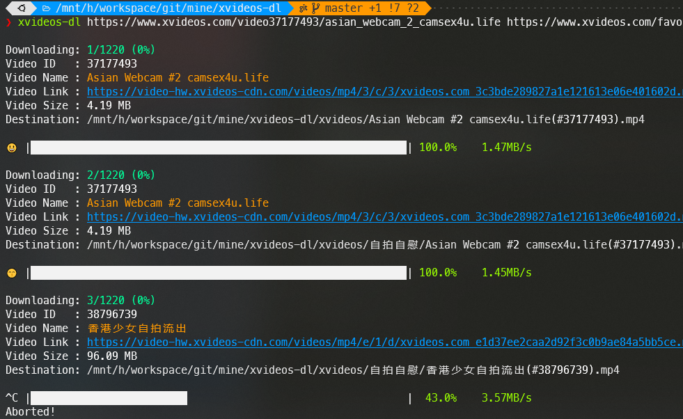

# xvideos-dl

<div align="center">

[](https://github.com/lonsty/xvideos-dl/actions?query=workflow%3Abuild)
[](https://pypi.org/project/xvideos-dl/)
[](https://github.com/lonsty/xvideos-dl/pulls?utf8=%E2%9C%93&q=is%3Apr%20author%3Aapp%2Fdependabot)

[](https://github.com/psf/black)
[](https://github.com/PyCQA/bandit)
[](https://github.com/lonsty/xvideos-dl/blob/master/.pre-commit-config.yaml)
[](https://github.com/lonsty/xvideos-dl/releases)
[](https://github.com/lonsty/xvideos-dl/blob/master/LICENSE)

https://xvideos.com H 片命令行下载工具

</div>

## 工具特点

- [X] 下载单个视频（需视频播放页的 URL）
- [X] 下载收藏夹中的所有视频（需收藏夹页的 URL）
- [X] 下载用户上传的所有视频（需用户首页的 URL）
- [X] 下载频道发布的所有视频（需频道首页的 URL）
- [X] 分段高速下载，断点下载，进度与状态显示

## 使用说明

### 安装工具 xvideos-dl

```bash
pip install -U xvideos-dl
```

### 获取工具使用帮助

```bash
xvideos-dl --help
```

### 下载视频

*注意：首此使用时，程序会出现提示语要求输入 Cookie，用个人账号登录 https://xvideos.com 获取 Cookie 粘贴到终端，即可继续运行。Cookie 可以长期使用。* 

只需一行命令，下载单个 / 收藏夹 / 用户上传 / 频道发布 的所有视频

```bash
xvideos-dl https://www.xvideos.com/video37177493/asian_webcam_2_camsex4u.life https://www.xvideos.com/favorite/71879935/_ https://www.xvideos.com/profiles/mypornstation https://www.xvideos.com/channels/av69tv  
```



## Release History

### 1.1.1

New Feature:

- Add parameters to control the start and end of the video in the download list.

Others:

- When running the same command repeatedly, quickly skip the downloaded video.
- Catch exceptions: 404 not found, forbidden downloading...

### 1.1.0

New Features:

- Download all videos uploaded by users.
- Download all videos posted by the channel.
- Download single, playlist, user uploaded and channel posted videos in one command.
- Optimize download status display.

### 1.0.1

New Features:

- Download videos from favorites.
- Show download speed.

### 1.0.0

Initial release on PyPY.
